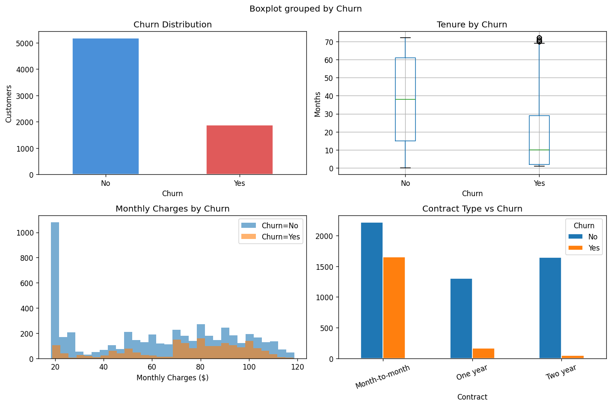
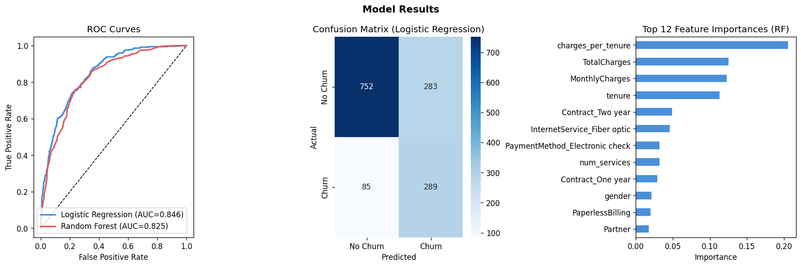

# Customer Churn Prediction

Predicting which telecom customers are likely to cancel their service, using the [IBM Telco Churn dataset](https://www.kaggle.com/datasets/blastchar/telco-customer-churn) from Kaggle (7,043 customers, 20 features).

## Why this matters

Retaining a customer is significantly cheaper than acquiring a new one. A model that identifies at-risk customers lets a retention team prioritize who to reach out to — whether that's offering a contract upgrade, resolving a service issue, or flagging for account review.

## What I did

**EDA first.** Before touching any models, I explored which variables showed the clearest relationship with churn. Contract type and tenure stood out immediately — month-to-month customers churn at 43% vs 3% for two-year contracts, and churners have roughly half the average tenure of retained customers.

**Feature engineering.** I added two derived features:
- `charges_per_tenure` — monthly charges divided by tenure. High values flag customers paying a lot before they've had time to build loyalty, which turned out to be the most predictive feature.
- `num_services` — count of add-on services subscribed to. More services = more switching cost = lower churn probability.

**Two models.** I started with logistic regression as a simple, interpretable baseline, then tried random forest to capture non-linear relationships and get feature importances. Logistic regression edged out on AUC (0.847 vs 0.825), so it's the primary model. Random forest is used for feature importance analysis.

**Class imbalance.** The dataset is 73% no-churn / 27% churn. Both models use `class_weight='balanced'` to avoid the model just predicting "no churn" for everything.

## Results

| Model | AUC | Churn Recall | Churn Precision |
|---|---|---|---|
| Logistic Regression | **0.847** | 77% | 51% |
| Random Forest | 0.825 | 66% | 56% |





## Key findings

1. **Contract type** is the clearest lever. Month-to-month customers churn at 43%. The first conversation with an at-risk customer should be about moving them to an annual contract.

2. **Fiber optic users churn at nearly 2x the rate of DSL users.** This suggests a pricing or service quality issue worth investigating separately from individual customer risk scores.

3. **Electronic check payers churn at ~45%** vs ~15% for auto-pay. Could be payment friction or financial instability — either way, an auto-pay migration campaign is a low-cost intervention.

4. **The first 6 months are highest risk.** Customers who make it to month 24 churn at under 15%. Early onboarding investment has compounding returns.

## How to run

pip install pandas numpy scikit-learn matplotlib seaborn

python churn_analysis.py

## Serving the model

The logistic regression model (feature engineering + scaling + classifier) is
serialized as a single pipeline and served behind a FastAPI app.

**Live endpoint:** `https://churn-prediction-8qvu.onrender.com`

```bash
curl -X POST https://churn-prediction-8qvu.onrender.com/predict \
  -H "Content-Type: application/json" \
  -d '{
    "gender": "Female", "SeniorCitizen": 0, "Partner": "Yes", "Dependents": "No",
    "tenure": 1, "PhoneService": "No", "MultipleLines": "No phone service",
    "InternetService": "DSL", "OnlineSecurity": "No", "OnlineBackup": "Yes",
    "DeviceProtection": "No", "TechSupport": "No", "StreamingTV": "No", "StreamingMovies": "No",
    "Contract": "Month-to-month", "PaperlessBilling": "Yes", "PaymentMethod": "Electronic check",
    "MonthlyCharges": 29.85, "TotalCharges": 29.85
  }'
# {"churn_probability": 0.827, "predicted_class": "Yes"}
```

`GET /health` returns `{"status": "ok"}`. Interactive API docs (Swagger UI) are
available at `/docs` on the live endpoint.

Note: the free Render tier spins the service down after 15 minutes of
inactivity, so the first request after a period of idleness can take up to
~50 seconds while it wakes up.

### Running it yourself

```bash
python train_model.py        # trains the pipeline, writes model.joblib
docker build -t churn-api .
docker run -p 8000:8000 churn-api
curl http://localhost:8000/health
```

## Potential next steps

- Tune the classification threshold based on the cost of false positives vs false negatives
- Try XGBoost to see if there's meaningful performance headroom
- Add SHAP values for per-customer explanations
