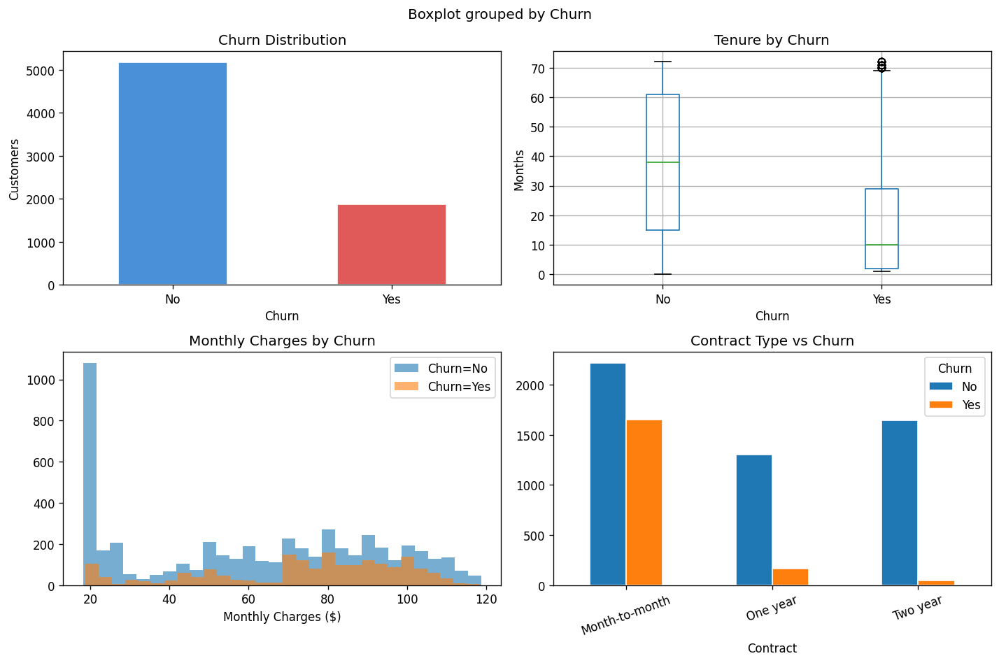
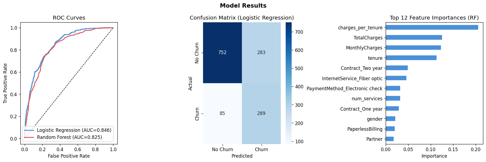

# Customer Churn Prediction

Predicting which telecom customers are likely to cancel their service, using the [IBM Telco Churn dataset](https://www.kaggle.com/datasets/blastchar/telco-customer-churn) from Kaggle (7,043 customers, 20 features). The trained model is served live as a FastAPI endpoint, not just a notebook.

## Live API

**`https://churn-prediction-8qvu.onrender.com`**: interactive docs (Swagger UI) at the root URL.

```bash
curl -X POST https://churn-prediction-8qvu.onrender.com/predict \
  -H "Content-Type: application/json" \
  -d '{
    "gender": "Female", "SeniorCitizen": 0, "Partner": "Yes", "Dependents": "No",
    "tenure": 1, "PhoneService": "No", "MultipleLines": "No phone service",
    "InternetService": "DSL", "OnlineSecurity": "No", "OnlineBackup": "Yes",
    "DeviceProtection": "No", "TechSupport": "No", "StreamingTV": "No", "StreamingMovies": "No",
    "Contract": "Month-to-month", "PaperlessBilling": "Yes", "PaymentMethod": "Electronic check",
    "MonthlyCharges": 29.85, "TotalCharges": 29.85
  }'
# {"churn_probability": 0.827, "predicted_class": "Yes", "decision_threshold": 0.5, "model_version": "1.1.0"}
```

Runs on Render's free tier, which spins down after 15 minutes of inactivity, so
**the first request after idle can take 30-60 seconds** while it wakes back
up. That's expected, not an outage.

## Why this matters

Retaining a customer is significantly cheaper than acquiring a new one. A model that identifies at-risk customers lets a retention team prioritize who to reach out to, whether that's offering a contract upgrade, resolving a service issue, or flagging for account review.

## What I did

**EDA first.** Before touching any models, I explored which variables showed the clearest relationship with churn. Contract type and tenure stood out immediately: month-to-month customers churn at 43% vs 3% for two-year contracts, and churners have roughly half the average tenure of retained customers.

**Feature engineering.** I added two derived features:
- `charges_per_tenure`: monthly charges divided by tenure. High values flag customers paying a lot before they've had time to build loyalty, which turned out to be the most predictive feature.
- `num_services`: count of add-on services subscribed to. More services = more switching cost = lower churn probability.

**Two models.** I started with logistic regression as a simple, interpretable baseline, then tried random forest to capture non-linear relationships and get feature importances. Logistic regression edged out on AUC (0.847 vs 0.825), so it's the primary model. Random forest is used for feature importance analysis.

**Class imbalance.** The dataset is 73% no-churn / 27% churn. Both models use `class_weight='balanced'` to avoid the model just predicting "no churn" for everything.

## Results

At the default 0.5 threshold:

| Model | AUC | Churn Recall | Churn Precision |
|---|---|---|---|
| Logistic Regression | **0.847** | 77% | 51% |
| Random Forest | 0.825 | 66% | 56% |





## Choosing the decision threshold

The model outputs a probability, and the threshold turns it into a yes/no call. Where
it sits is a business trade-off: a missed churner costs the customer, while a false
alarm costs a retention offer spent on someone who was staying anyway.

`train_model.py` sets the threshold by minimizing expected cost on out-of-fold
predictions from 5-fold cross-validation on the training split, so the holdout never
influences the choice. The cost ratio is the cost of one missed churner relative to one
wasted offer. With no real retention economics to work from, the default ratio is the
class ratio, about 2.8 non-churners per churner, which is the same trade the balanced
class weights already make. At that ratio the cost-minimizing threshold is 0.50, and
that is what the API serves: 77.5% recall and 50.9% precision on the holdout, with
40.5% of customers flagged.

If the business knows its numbers, the threshold moves (`threshold_analysis.csv`):

| Missed churner vs. wasted offer | Threshold | Holdout recall | Holdout precision | Customers flagged |
|---|---|---|---|---|
| 1 : 1 | 0.73 | 53.2% | 67.0% | 21.1% |
| 2 : 1 | 0.62 | 69.0% | 57.3% | 31.9% |
| **2.8 : 1 (default)** | **0.50** | **77.5%** | **50.9%** | **40.5%** |
| 3 : 1 | 0.48 | 80.2% | 50.1% | 42.5% |
| 5 : 1 | 0.34 | 90.4% | 44.6% | 53.7% |
| 10 : 1 | 0.20 | 96.0% | 39.0% | 65.4% |

Retrain with `python train_model.py --cost-ratio 5` to bake a different threshold into
`model.joblib`, or set `CHURN_THRESHOLD` on the service to override it without
retraining. Every `/predict` response reports the threshold it used.

## Key findings

1. **Contract type** is the clearest lever. Month-to-month customers churn at 43%. The first conversation with an at-risk customer should be about moving them to an annual contract.

2. **Fiber optic users churn at nearly 2x the rate of DSL users.** This suggests a pricing or service quality issue worth investigating separately from individual customer risk scores.

3. **Electronic check payers churn at ~45%** vs ~15% for auto-pay. Could be payment friction or financial instability; either way, an auto-pay migration campaign is a low-cost intervention.

4. **The first 6 months are highest risk.** Customers who make it to month 24 churn at under 15%. Early onboarding investment has compounding returns.

## How to run

pip install pandas numpy scikit-learn matplotlib seaborn

python churn_analysis.py

## Serving the model

The logistic regression model (feature engineering + scaling + classifier) is
trained as a single `sklearn.Pipeline`, joblib-serialized to `model.joblib`
along with its version string and decision threshold, and loaded once at API
startup, so the API can never drift from what was actually trained. `POST /predict` validates
the request against a Pydantic model built from the same column list the
pipeline was trained on (`app/features.py`); a malformed request gets a 422
with a clear message instead of a silent bad prediction. `GET /health`
returns `{"status": "ok"}`.

### Running it yourself

```bash
python train_model.py        # trains the pipeline, picks the threshold, writes model.joblib
docker build -t churn-api .
docker run -p 8000:8000 churn-api
curl http://localhost:8000/health
```

### Tests

```bash
pip install -r requirements-dev.txt
pytest
```

Covers: a known input returns a probability in `[0, 1]`, a missing field
returns 422, `/health` returns 200, the request schema hasn't drifted from
the training column list, and the predicted class follows the served
threshold. The threshold selection itself is unit-tested on synthetic data.

## Potential next steps

- Try XGBoost to see if there's meaningful performance headroom
- Add SHAP values for per-customer explanations
